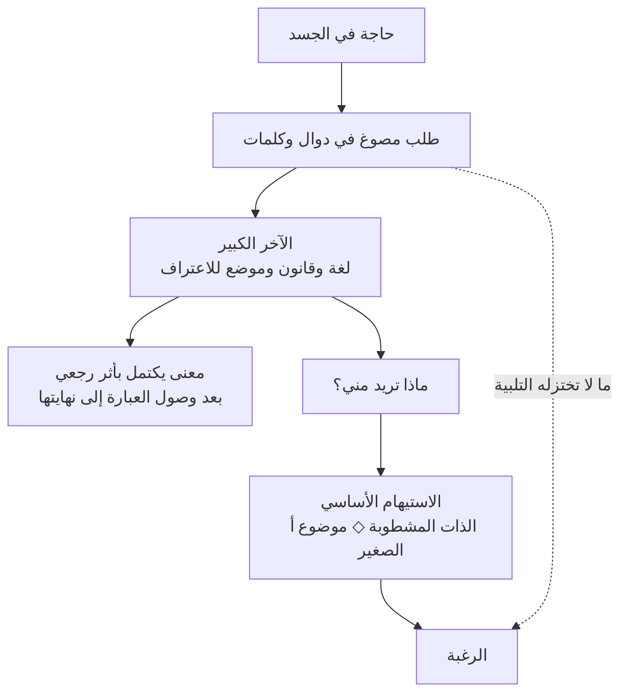

# جاك لاكان — الرغبة التي تمر عبر سؤال الآخر

يقول شخص لمن يحب: «لا أريد منك شيئًا، أريد فقط أن أعرف أنك تريدني». قد يسمع الجواب الذي طلبه، ثم يعاود السؤال بعد ساعة بصيغة أخرى. لو كان يبحث عن معلومة لكفاه الجواب الأول. ولو كان يطلب جملةً بعينها لانتهى الأمر حين قيلت. لكن شيئًا في الطلب لم يصل مع الكلمات التي لبّته.

من هذا الشيء المتبقي يبدأ جاك لاكان (Jacques Lacan). لم يسأل عن الرغبة كما يسأل فيلسوف أخلاق: أي الرغبات أجدر بأن تُتّبع؟ بدأ، بوصفه طبيبًا نفسيًا ومحللًا، من عثرة أسبق: لماذا لا يعرف المتكلم تمامًا ما يطلبه، ولماذا لا ينطفئ طلبه حين يحصل على الشيء الذي سمّاه؟

## الحاجة حين تضطر إلى الكلام

الجوع حاجة، والطعام يستطيع أن يشبعها. لكن الرضيع لا يمد يده إلى الطعام من عالم خالٍ من البشر؛ يبكي، فيأتي شخص آخر ويفسر البكاء: جائع، متألم، يريد أن يُحمَل. منذ هذه اللحظة لا تعود الحاجة تعبر إلى موضوعها مباشرة. يجب أن تمر بعلامة يفهمها آخر، ثم بكلمة وقاعدة وطريقة مقبولة في السؤال.

يسمي لاكان الحاجة بعد دخولها اللغة **طلبًا**. والطلب لا يحمل الحاجة وحدها. حين يطلب الطفل الطعام، يطلب أيضًا أن يُسمَع وأن يعود الآخر من أجله؛ وحين يسأل العاشق «هل تحبني؟» لا يطلب تقريرًا عن حالة نفسية فحسب، بل يطلب حضورًا وضمانًا لا تستطيع جملة واحدة أن تمنحهما إلى الأبد. لذلك يقول لاكان إن كل طلب يحمل في قاعه طلبًا للحب.

يمكن إشباع الحاجة، ويمكن تلبية الطلب المعلن، لكن لا يمكن تسليم حب الآخر واعترافه كأنهما شيء يوضعان إلى جوار الطعام. ما يتبقى من الطلب بعد فصل الحاجة القابلة للإشباع عنه هو الرغبة. هذه صيغة بنيوية، لا مسألة حساب: الرغبة هي الفارق الذي فتحته اللغة بين ما احتاجه الجسد، وما استطاعت الذات أن تقوله، وما سمعت أن الآخر فهمه منها.

لهذا لا يعني النقص عند لاكان أن هناك قطعةً أصلية ضاعت في مكان ما، وأن الموضوع المناسب سيعيدها. النقص أثر تكوّن الذات نفسها بوصفها ذاتًا تتكلم. لا توجد عودة إلى حاجة صافية قبل اللغة، لأن من يريد العودة صار بالفعل ذلك الكائن الذي تعلّم أن يقول «أنا» بكلمات لم يخترعها.

## لماذا احتاجت الرغبة إلى مخطط؟

طوّر لاكان **مخطط الرغبة** (*Graph of Desire*) في ندواته عن تكوينات اللاوعي وعن الرغبة وتأويلها، ثم عرضه في نص «تقويض الذات وجدلية الرغبة في اللاوعي الفرويدي». منظره المكتمل شديد الكثافة: خطان متقاطعان، وطابقان، وأسهم تعود على نفسها، وحروف مثل `$` و`A` و`a`. لكنه لا يرسم غرفًا داخل الدماغ، ولا مراحل زمنية يقطعها الطفل مرةً ثم يتركها خلفه. إنه يحاول تثبيت حركات تحدث معًا كلما تكلمت ذاتٌ إلى آخر.

هذه خريطة قراءة مبسطة، لا نسخة من اتجاهات المخطط الأصلي:

### التقاطع الأول: لا أعرف معنى كلامي قبل أن ينتهي

في أسفل المخطط يقطع قصد المتكلم سلسلة الدوال مرتين. العبور الأول يدخله مجال **الآخر الكبير** (*big Other*)، الذي يرمز إليه الحرف `A`: لا شخصًا خفيًا يراقبه، بل مخزون اللغة وقواعدها والموضع الذي يجب أن يعترف بالعبارة كي تصير ذات معنى. والعبور الثاني يعيد إليه رسالته بعد أن اكتملت عند `s(A)`، أي المعنى أو الرسالة كما تشكلت في حقل الآخر.

فمعنى الجملة لا يسير دائمًا أمامها كقائد يعرف الطريق. قد تبدأ عبارةً نظنها اعترافًا، ثم تجعلها الكلمة الأخيرة سخرية؛ وقد يختار المتكلم لفظًا عابرًا فيكشف زلّةً لم يقصد عرضها. النهاية لا تضيف جزءًا أخيرًا فقط، بل تعود فتوزع معنى الأجزاء السابقة. يسمي لاكان هذا التثبيت الراجع للمعنى **نقطة التنجيد** (*point de capiton*): كما تثبت غرزةٌ سطح القماش بما تحته، تثبت لحظة في السلسلة معنى كان قبلها معلقًا.

لكن الرسالة حين تعود لا تعيد إلى المتكلم ذاتًا مطابقة لقصدها. الرمز `$` يعني **الذات المشطوبة** أو المنقسمة (*barred subject*): ذات تقول أكثر مما تعرف، وتعرف أحيانًا أكثر مما تستطيع قوله، ولا تتطابق «أنا» التي تتحدث مع الأنا التي تصفها الجملة. اللاوعي هنا ليس قبوًا صامتًا تحت الكلام؛ إنه يظهر في الانقطاع والتكرار والنكتة وزلة اللسان، أي في الموضع الذي لا يملك فيه المتكلم عبارته ملكًا كاملًا.

ويجري أسفل هذه السلسلة طريق أقصر بين صورة الجسد `i(a)` والأنا `m`. هذه دائرة المرآة: أرى نفسي في صورة تبدو أكثر تماسكًا من خبرتي المتقطعة، ثم أتكلم كما لو كانت تلك الصورة هي مصدر كلامي. ويظهر `I(A)`، **مثال الأنا** (*ego ideal*)، بوصفه الموضع الرمزي الذي أتخيل أن الآخر ينظر إليّ منه ويقيسني به. لا يضيف لاكان هذه العلامات للزينة؛ يريد أن يقول إن «أنا أعرف ما أريد» تصدر من أنا صاغتها صورة ونظرة قبل أن تصدر من سيد داخلي مستقل.

### التقاطع الثاني: ماذا يريد الآخر مني؟

لو كان الآخر مجرد قاموس، لانتهت المسألة حين أصبحت الجملة مفهومة. لكن الآخر نفسه يرغب، يصمت، يقترب ويبتعد، ويطلب أشياء لا يفسر سببها. عندئذ ينفتح السؤال الذي كتبه لاكان بالإيطالية ثم ينبغي قوله بالعربية أولًا: **ماذا تريد؟** (*Che vuoi?*)؛ وفي صيغته الأشد قلقًا: ماذا تريد مني، وأي شيء تريدني أن أكونه في رغبتك؟

هذا هو سبب الطابق الأعلى في المخطط. الكلام الظاهر قد يقول «أريد هذا العمل» أو «أريد هذا الشخص»، بينما يحمل التلفظ سؤالًا آخر: إذا حصلت عليه، فماذا سأصير في عين من يملك أن يعترف بي؟ وهل أريده لأن فيه شيئًا، أم لأن رغبة شخص آخر جعلته مرئيًا؟ عند العلامة `d` لا نجد اسم موضوع، بل موضع الرغبة نفسها وهي تنحرف عن الطلب المعلن.

لهذا فقول لاكان إن «رغبة الإنسان هي رغبة الآخر» لا يملك معنى واحدًا مريحًا. الرغبة تتشكل بدوال أخذناها من الآخرين؛ وقد نرغب في أن يرغبوا فينا؛ وقد نقتبس منهم ما يستحق أن يُرغب فيه؛ ونظل نسأل، من داخل خطابهم، ما الذي يريدونه منا. لا يجعلنا هذا دمى اجتماعية، لكنه يسقط وهم أن الرغبة صوت طبيعي نقي تكفي إزالة المحظورات كي نسمعه.

### الجواب الذي يحمينا من سؤال بلا جواب

لا يملك الآخر الكبير كلمةً أخيرة تقول للذات ما هي أو ما الذي ينبغي أن تريده. في المخطط تُكتب هذه الفجوة `S(Ⱥ)`، أي دالّ نقص الآخر. فاللغة تستطيع أن تعرّف وتعد وتحكم، لكنها لا تضم كلمةً نهائية تضمن معنى الحياة أو تثبت أن المحبوب سيظل راغبًا إلى الأبد.

أمام هذا النقص تبني الذات **استيهامًا أساسيًا** (*fundamental fantasy*). لا يعني الاستيهام حلم يقظة سخيفًا، بل مشهدًا ضمنيًا ترتب فيه الذات علاقتها بما تظنه مطلوبًا منها وبما يسبب رغبتها. يكتبه لاكان `$ ◇ a`: ذات منقسمة في علاقة متحركة بـ**موضوع أ الصغير** (*objet petit a*).

وموضوع أ الصغير ليس الغاية التي تريدها الرغبة سرًا. إنه **سبب الرغبة**: ذلك الفائض الذي يجعل شيئًا بعينه يلمع كأنه يحمل الجواب. قد تتجسد اللمعة في صوت أو نظرة أو شخص أو منزلة، لكن الشيء المتجسد لا يساوي السبب الذي حمّله بريقه. لذلك ينتقل الاشتهاء بعد الامتلاك إلى موضوع آخر. لم يكن الموضوع الأول كذبة؛ كان حاملًا مؤقتًا لشيء لا يستطيع أن يحتويه كاملًا.

هنا ينبغي التفريق بين الرغبة والدافع. الرغبة تنزلق من موضوع إلى آخر لأنها لا تجد «الشيء نفسه». أما الدافع، الذي يكتبه المخطط `$ ◇ D` بوصفه علاقة الذات بطلب لا يكف عن العودة، فيستطيع أن يستخرج إشباعًا غريبًا من الدوران المتكرر حول موضع الفقد. قد يشتكي إنسان من أنه يفشل بالطريقة نفسها، فيما يحمل التكرار نفسه لذةً مؤلمة لا يمنحها النجاح. المخطط لا يقول إن كل رغبة تتمنى الفشل؛ يقول إن التلبية والرضا ليسا الحركة نفسها.

من هذه النقطة يبدأ اختلاف [[جورج باتاي — الإيروسية حين يريد الجسد أن يفقد حدوده|جورج باتاي (Georges Bataille)]]: لاكان يحفظ النقص الذي يجعل الرغبة تتحرك، أما باتاي فيدفع الإيروسية نحو لحظة تهتز فيها حدود الذات الراغبة نفسها.

## فاوست: الرجل الذي جعل عدم الاكتفاء ضمانته

لهذا استدعى [[Faust — اللحظة التي تطلب من الزمن أن يتوقف|فاوست]] اسم لاكان. ينتقل فاوست من المعرفة إلى السحر، ومن الحب إلى المشروع، كأن كل موضوع يعده بأن يكون هو الأخير ثم يفقد قدرته على الإغلاق. لكن لا ينبغي تحويل المسرحية إلى مثال مدرسي على نظرية لاحقة. فاوست يوقّع رهانًا تاريخيًا ولاهوتيًا خاصًا، ولاكان يصف بنية الذات الناطقة. الجسر بينهما أضيق وأصدق: الشيء المطلوب يتغير، بينما يبقى في الطلب ما لا يستطيع الشيء أن يلبّيه.

يقف [[Don Juan — الرجل الذي استدان من الغد|دون جوان (Don Juan)]] في الجوار من جهة أخرى. لا يريد امرأة بعينها بقدر ما يريد استمرار فعل الاشتهاء. يستطيع «موضوع أ الصغير» أن يفسر لماذا لا تتطابق أي امرأة مع السبب الذي يدفع الحركة، لكنه لا يبرئ المغوي ولا يحول النساء إلى رموز في اقتصاد رغبته. النظرية التي ترى بنية التكرار وتفقد الأشخاص الذين دُفعوا ثمنًا له تكون قد أعادت خطيئة بطلها بلغة أذكى.

## ما الذي يشرحه المخطط، وما الذي لا يشرحه؟

قوة المخطط أنه يمنع ثلاثة اختزالات: الرغبة ليست حاجةً أكبر، والطلب ليس تصريحًا شفافًا بها، والآخر ليس مجرد شخص يستطيع منحها أو منعها. إنه يصل هذا كله بما بدأته [[اللغة التي تفكر فينا — بين الاسم والعالم]]: اللغة لا تنقل قصدًا مكتملًا فقط؛ تعيد تشكيل المتكلم وهي تمنحه طريقًا إلى غيره.

لكن المخطط ليس برهانًا تجريبيًا في علم الأعصاب، وقصة الرضيع فيه لا ينبغي أن تُقرأ كتسلسل مصوّر لكل طفل. إنها بناء نظري يصف اعتماد الإنسان على العلامة والآخر. كما لا يجوز استعمال «كل طلب طلب حب» لمحو الحاجة المادية: الجائع يحتاج إلى طعام فعلًا، والمحروم من الأمان لا يصنع حرمانه باللغة وحدها. إن أضاء التحليل فائضًا في الطلب، فهذا لا يلغي موضوع الطلب ولا مسؤولية من يستطيع تلبيته.

وليس مقصد التحليل أن يقتل الرغبة أو يجد لها موضوعها الأخير. ما يستطيع فعله هو أن يجعل الذات تسمع ما تكرره من غير علمها، وترى أين تتكلم بلسان مطلب الآخر، ثم تتحمل مسؤولية رغبتها من غير ادعاء أنها صنعت وحدها اللغة التي رغبت بها.

## مفاتيح للقراءة

- جاك لاكان، «تقويض الذات وجدلية الرغبة في اللاوعي الفرويدي» (*The Subversion of the Subject and the Dialectic of Desire in the Freudian Unconscious*)، ضمن *كتابات* (*Écrits*)؛ وهو النص الذي يعرض الصورة المكتملة لمخطط الرغبة.
- جاك لاكان، *الندوة، الكتاب الخامس: تكوينات اللاوعي* (*The Seminar, Book V: Formations of the Unconscious*)؛ لتكوّن المخطط وصلته بالنكتة والاستعارة والطلب.
- جاك لاكان، *الندوة، الكتاب السادس: الرغبة وتأويلها* (*The Seminar, Book VI: Desire and Its Interpretation*)؛ للطابق الأعلى وسؤال «ماذا تريد؟» والاستيهام.
- بروس فينك (Bruce Fink)، *الذات اللاكانية: بين اللغة والمتعة المؤلمة* (*The Lacanian Subject: Between Language and Jouissance*)؛ مدخل يشرح الدوال والذات المشطوبة وموضوع أ الصغير من غير اختصارها إلى قاموس.
- فيليب فان أوت (Philippe Van Haute)، *ضد التكيّف: «تقويض الذات» عند لاكان* (*Against Adaptation: Lacan's “Subversion of the Subject”*)؛ قراءة بطيئة للمخطط بوصفه اعتراضًا على جعل التحليل النفسي تدريبًا للأنا على الامتثال.
